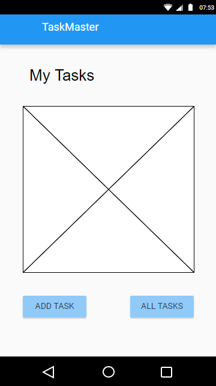
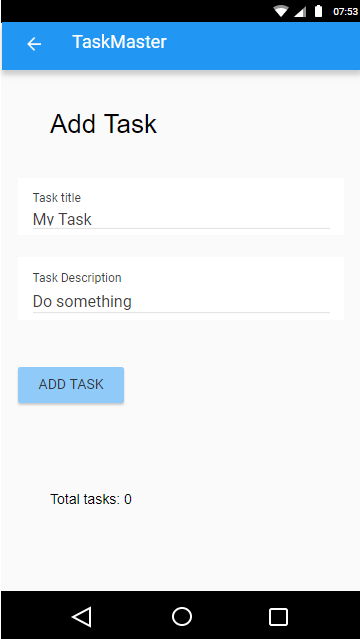
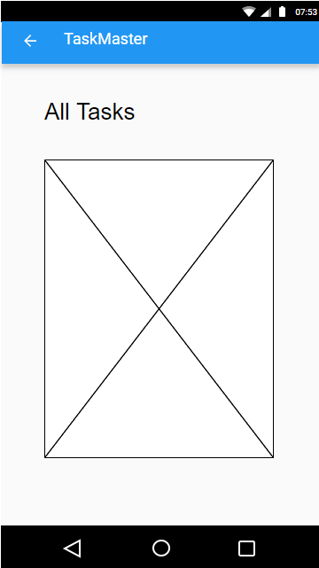

# Taskmaster
**Author**: Haustin Kimbrough
**Version**: 1.0.0

## Overview
<!-- Provide a high level overview of what this application is and why you are building it, beyond the fact that it's an assignment for this class. (i.e. What's your problem domain?) -->

An application to manage tasks.

## Architecture
<!-- Provide a detailed description of the application design. What technologies (languages, libraries, etc) you're using, and any other relevant design information. -->

Application is an android application programmed using the Java language. 

- The main page should have a heading at the top of the page, an image to mock the “my tasks” view, and buttons at the bottom of the page to allow going to the “add tasks” and “all tasks” page.

### Wireframe

### Screenshot

On the “Add a Task” page, allow users to type in details about a new task, specifically a title and a body. When users click the “submit” button, show a “submitted!” label on the page.
### Wireframe

### Screenshot

The all tasks page should just be an image with a back button; it needs no functionality.

### Wireframe

### Screenshot

## Credit and Collaborations
<!-- Give credit (and a link) to other people or resources that helped you build this application. -->

