# Taskmaster
**Author**: Haustin Kimbrough
**Version**: 1.0.5

**[APK](app-debug.apk) located in root of application.**

## Overview
<!-- Provide a high level overview of what this application is and why you are building it, beyond the fact that it's an assignment for this class. (i.e. What's your problem domain?) -->

An application to manage tasks.

## Architecture
<!-- Provide a detailed description of the application design. What technologies (languages, libraries, etc) you're using, and any other relevant design information. -->

Application is an android application programmed using the Java language. Tested using Espresso.

### Login
- First page a user is directed to.
- Offers user chance to click "Signup" button if no account has been created yet.
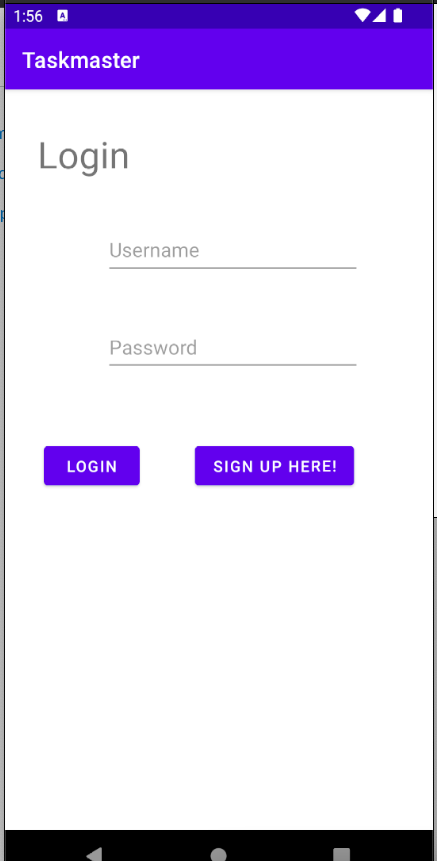

### Signup
- Allows user to fill out username and password to sign up.
- If successful, redirects to verification page and sends email to user's email.
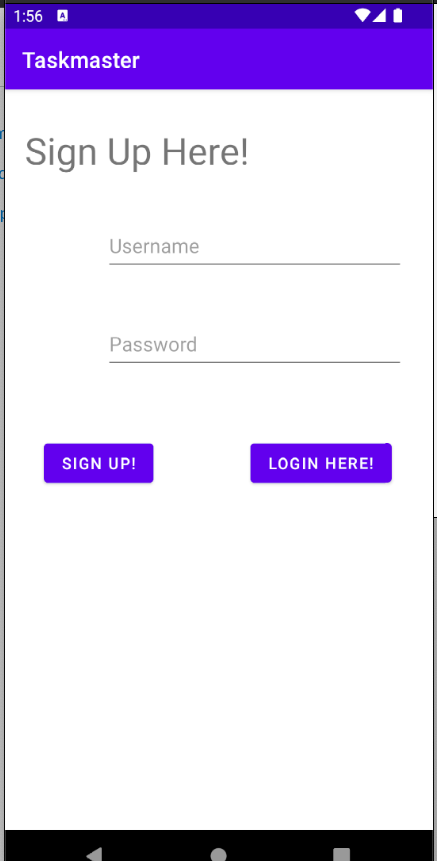

### Verify
- Allows user to enter verification code sent to email.
- If correct username and code is entered, redirects to login page.
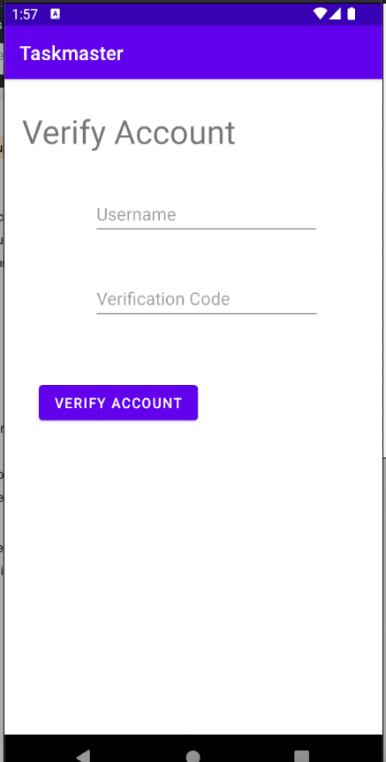

### Homepage

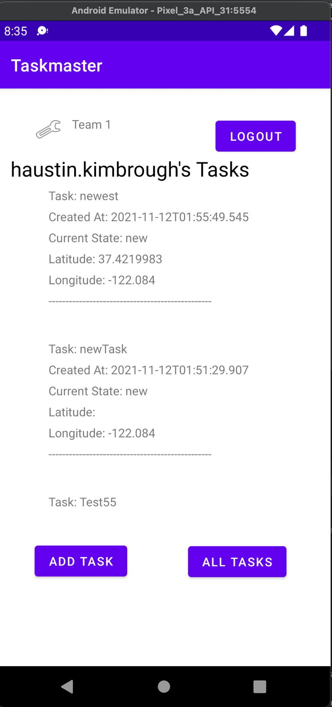
- The main page should have a heading at the top of the page and buttons at the bottom of the page to allow going to the “add tasks” and “all tasks” page.
- Additionally, it contains a RecyclerView that displays a user's specific team's tasks pulled from DynamoDB, sorted in order of creation with the most recent at the top.
- When a user taps one of the tasks, it should go to the Task Detail page, and the task title, body, and state should match the task that was tapped on the previous page.
- Also, an wrench image allows users to visit the Settings page, and once the user has entered their username and/or team, it should display “{username}’s tasks” and "Team X" above the three task buttons.
- The application has a Task entity. A Task should have a title, a body, and a state. The state should be one of “new”, “assigned”, “in progress”, or “complete” (still needs to be implemented).
- The application has a Team entity. A Team owns many tasks. A team has a name.

### Add Task

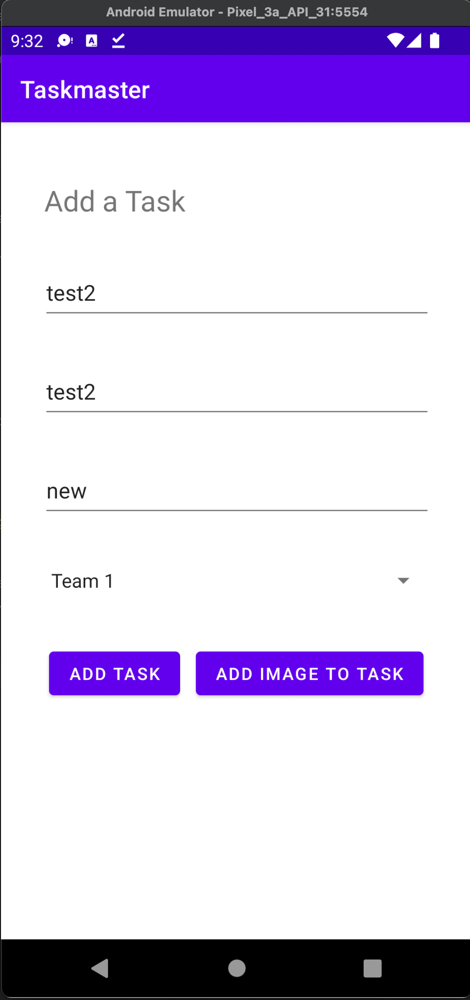

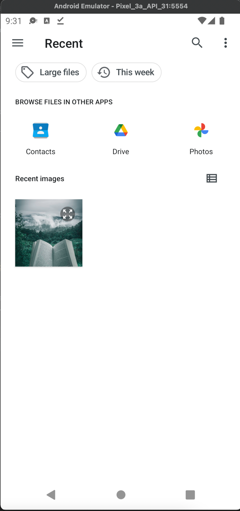

- On the “Add a Task” page, allow users to type in details about a new task, specifically a title, body, status, and assign a team.
- When users click the "Add Image to Task" button, allows users to pick a local image and assign it to a task.
- When users click the “submit” button, adds the new Task to DynamoDB and shows a Toast affirming addition to DB.
- Also redirects user to Homepage and updates list there with new Task if the task created was apart of the user's selected Team.

### Add Task from Another Application
- Allow users to initiate adding a task from another application by sharing a picture to Taskmaster

#### Step 1 

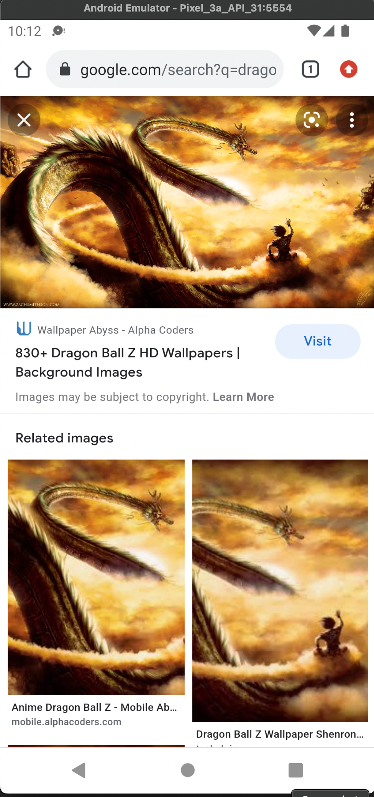

- Find an image you want to attach to a task.

#### Step 2

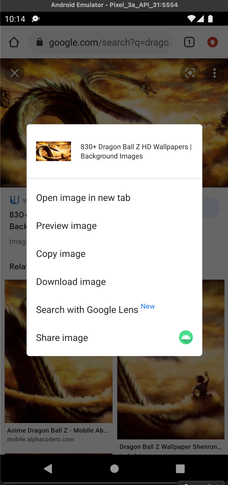

- Click and hold until the share option appears and click it.

#### Step 3

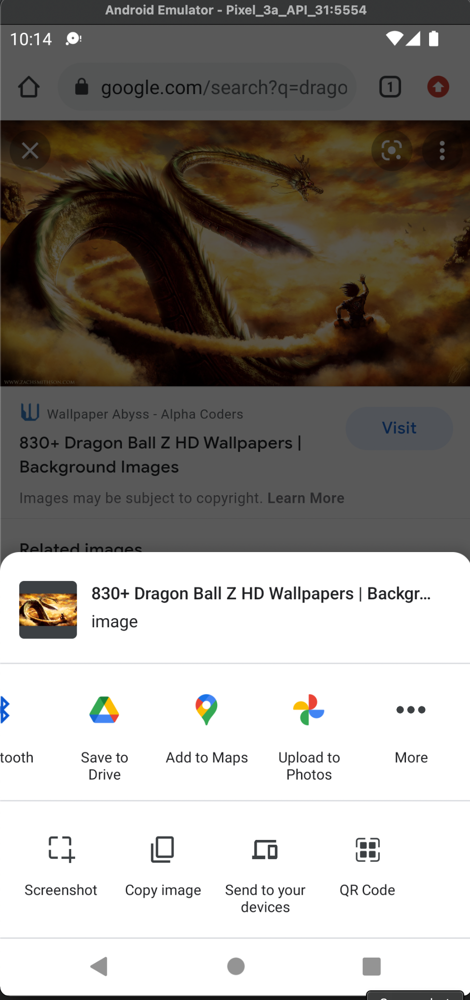

- Scroll all the way to the right and select "More" option.

#### Step 4

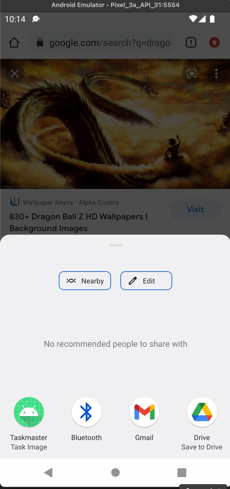

- Select Taskmaster

#### Step 5

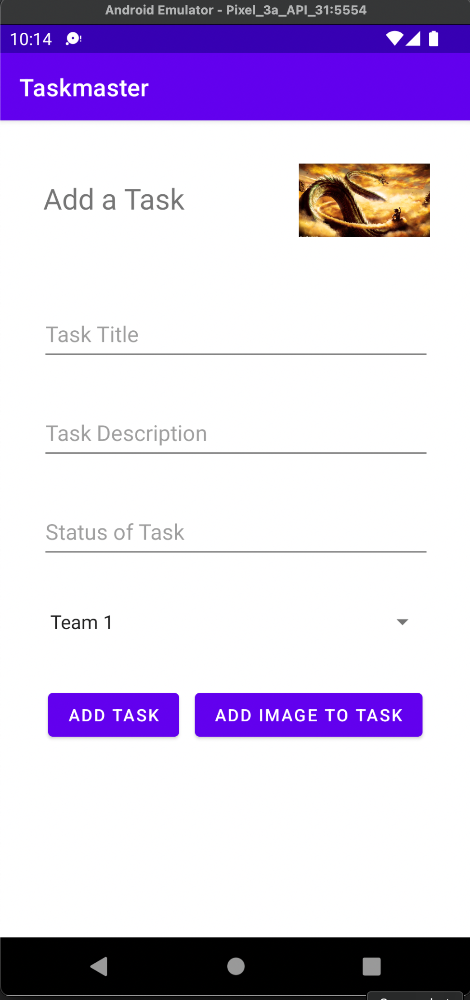

- Fill in the rest of the data about your Task and save it.

**Currently still needs bug fixes. After adding task this way, image does not reappear in TaskDetailsActivity**

### All Tasks

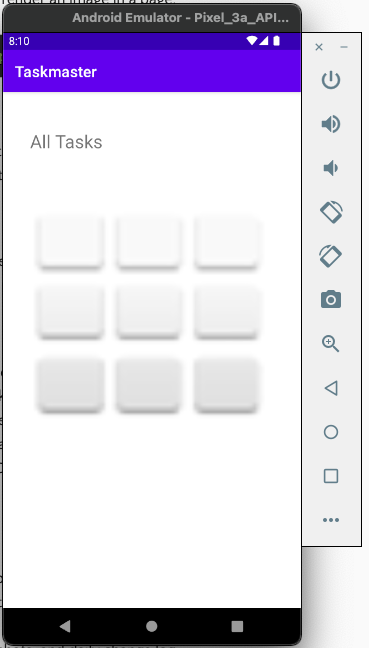

- The all tasks page should just be an image with a back button; it has no functionality.

### Settings

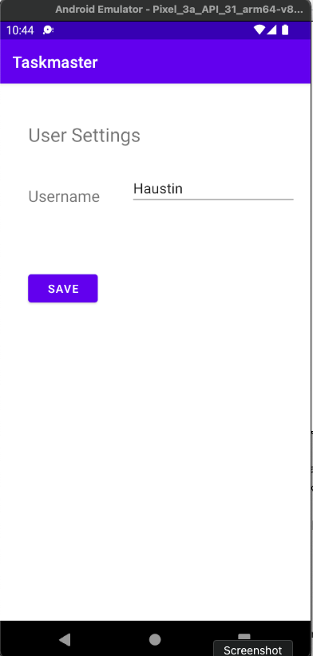

- Allow users to enter their username and/or select a team and then save.
- Saved usernames and teams will display on homepage.

### Task Detail

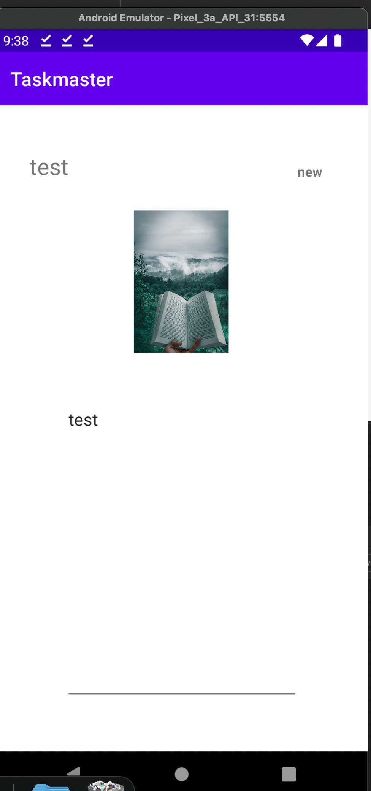

- Should have a title at the top of the page, a description, status, and image displayed.

## Daily Changelog
### Day 1
#### Task for the Day
1. Homepage
    - Add heading to the top of the page
    - Adds image to mock "my tasks" view
    - Adds buttons at the bottom of the page to allow going to "add task" and "all tasks" pages
    
2. Add Task page
    - Allow users to type in details about a new task, specifically title and body
    - When the user clicks the "submit" button, show a "submitted!" label
    
3. All Tasks page
    - Just an image with a back button; needs no functionality

### Day 2
#### Task for the Day
1. Task Details page
    - Create a Task Detail page.
    - It should have a title at the top of the page, and a Lorem Ipsum description.

2. Settings Page
    - Adds a Settings page accessible by a wrench icon in top right of the home screen.
    
3. Homepage Modification
   - Homepage modified to contain three different buttons with hardcoded task titles.
   - When a user taps one of the titles, it should go to the Task Detail page, and the title at the top of the page should match the task title that was tapped on the previous page. 
   - The homepage should also contain a button to visit the Settings page, and once the user has entered their username, it should display “{username}’s tasks” above the three task buttons.

### Day 3
#### Task for the Day
1. Homepage Refactor
   - Refactor your homepage to use a RecyclerView for displaying Task data. This should have hardcoded Task data for now. 
   - Create a ViewAdapter class that displays data from a list of Tasks.
   - Creates at least three hardcoded Task instances and uses those to populate your RecyclerView/ViewAdapter.
   - Ensure that you can tap on any one of the Tasks in the RecyclerView, and it will appropriately launch the detail page, displaying the correct Task title, description, state, and date created.

### Day 4
#### Task for the Day
1. Task Modal and Room
   - Sets up Room and modifies Task class to be an Entity
   
2. Add Task Form
   - Modifies Add Task form to save the data entered in as a Task in Room database
   
3. Homepage Refactor
   - I did not get to implement this
   - Should be refactored to display Task entities from Room database
   
4. Details Page
   - No change to this page - though it was empty since I commented out my hard-coded test tasks while trying to get Room to work.

### Day 5
#### Task for the Day
1. Espresso Testing
   - Adds three Espresso tests:
      - assert that important UI elements are displayed on the page (buttons, images, titles)
      - tap on a task, and assert that the resulting activity displays the name of that task 
      - edit the user’s username, and assert that it updates on the homepage

### Day 6
#### Task for the Day
1. Amplify 
   - Creates a Task resource that replicates our existing Task schema. 
   - Update all references to the Task data to instead use AWS Amplify to access your data in DynamoDB instead of in Room.
   
2. Add Task Form
   - Modifies Add Task form to save the data entered in as a Task to DynamoDB.

3. Homepage
   - Refactors Homepage RecyclerView to display Tasks entities from DynamoDB.

### Day 7
#### Task for the Day
1. Teams
   - Creates a second entity, Team, which has a name and a list of tasks. 
   - Updates tasks to be owned by a team.
   - Manually created three teams (User cannot create new teams.)

2. Add Task Form
   - Modifies Add Task form to include a Spinner for which team that task belongs to.
   
3. Settings Page
   - In addition to a username, allows the user to choose their team. 
   - Uses that Team to display only that team’s tasks on the homepage.
   
4. Homepage
   - TODO:
     - Add functionality that will not show any tasks if the user has not selected their team.
     - Clean up display of tasks.

### Day 8
#### Task for the Day
1. Build Final APK
   - Added release directory with app-release.aab to file system for deploying to Google Play Store.
   - Couldn't get the link copied from Console to paste/take me to where I could internally test/download my app.
   - Everytime I copied link and pasted, it would just refresh the page I was on.
   - Should be up-to-date otherwise.
   - Unsure if a new/updated APK is needed at this point, but I'll build one anyways.

### Day 9
#### Task for the Day
1. Cognito
   - Adds Cognito to application
   - Adds user login page and functionality
   - Adds user signup page and functionality
   - Adds user verify page and functionality
   - Adds logout button and functionality
   
2. Homepage
   - Updates homepage title with user's username
   - Intend to update so that if a user sets a nickname in userSettingsActivity, it will override username display.

### Day 10
#### Task for the Day
1. Uploads
   - On the “Add a Task” activity, allow users to optionally select a file to attach to that task.
   - If a user attaches a file to a task, that file should be uploaded to S3, and associated with that task.
   
2. Displaying Files
   - On the Task detail activity, if there is a file that is an image associated with a particular Task, that image should be displayed within that activity.
   
3. General
   - Updates homepage to display the first part of user's email (everything before the "@").

### Day 11
#### Task for the Day
1. Adding a Task from Another Application
   - Add an intent filter to your application such that a user can hit the “share” button on an image in another application, choose TaskMaster as the app to share that image with, and be taken directly to the Add a Task activity with that image pre-selected.
   - **Currently still needs bug fixes. After adding task this way, image does not reappear in TaskDetailsActivity**

## Credit and Collaborations
<!-- Give credit (and a link) to other people or resources that helped you build this application. -->

