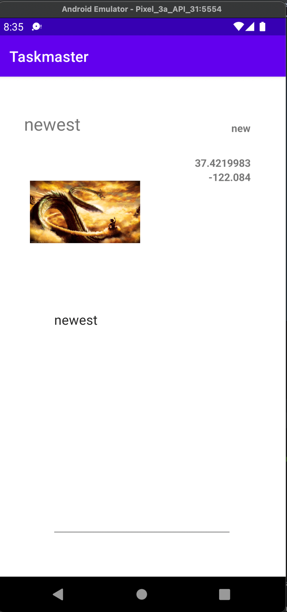

# Taskmaster
**Author**: Haustin Kimbrough
**Version**: 1.0.5

## Overview
<!-- Provide a high level overview of what this application is and why you are building it, beyond the fact that it's an assignment for this class. (i.e. What's your problem domain?) -->

An application to manage tasks.

## Architecture
<!-- Provide a detailed description of the application design. What technologies (languages, libraries, etc) you're using, and any other relevant design information. -->

Application is an android application programmed using the Java language. Tested using Espresso.

### Homepage

- The main page should have a heading at the top of the page and buttons at the bottom of the page to allow going to the “add tasks” and “all tasks” page.
- Additionally, it contains a RecyclerView that displays a user's tasks (currently hard-coded).
- When a user taps one of the tasks, it should go to the Task Detail page, and the task title, body, state, and addedOn should match the task that was tapped on the previous page.
- Also, an wrench image allows users to visit the Settings page, and once the user has entered their username, it should display “{username}’s tasks” above the three task buttons.
- The application has a Task class. A Task should have a title, a body, and a state. The state should be one of “new”, “assigned”, “in progress”, or “complete”.

### Add Task

- On the “Add a Task” page, allow users to type in details about a new task, specifically a title and a body. When users click the “submit” button, show a “submitted!” label on the page.

### All Tasks

- The all tasks page should just be an image with a back button; it needs no functionality.

### Settings Screenshot

- Settings page. It should allow users to enter their username and hit save.

### Task Detail Screenshot

- Task Detail page should have a title at the top of the page, and a Lorem Ipsum description.

## Daily Changelog
### Day 1
#### Task for the Day
1. Homepage
    - Add heading to the top of the page
    - Adds image to mock "my tasks" view
    - Adds buttons at the bottom of the page to allow going to "add task" and "all tasks" pages
    
2. Add Task page
    - Allow users to type in details about a new task, specifically title and body
    - When the user clicks the "submit" button, show a "submitted!" label
    
3. All Tasks page
    - Just an image with a back button; needs no functionality

### Day 2
#### Task for the Day
1. Task Details page
    - Create a Task Detail page.
    - It should have a title at the top of the page, and a Lorem Ipsum description.

2. Settings Page
    - Adds a Settings page accessible by a wrench icon in top right of the home screen.
    
3. Homepage Modification
   - Homepage modified to contain three different buttons with hardcoded task titles.
   - When a user taps one of the titles, it should go to the Task Detail page, and the title at the top of the page should match the task title that was tapped on the previous page. 
   - The homepage should also contain a button to visit the Settings page, and once the user has entered their username, it should display “{username}’s tasks” above the three task buttons.

### Day 3
#### Task for the Day
1. Homepage Refactor
   - Refactor your homepage to use a RecyclerView for displaying Task data. This should have hardcoded Task data for now. 
   - Create a ViewAdapter class that displays data from a list of Tasks.
   - Creates at least three hardcoded Task instances and uses those to populate your RecyclerView/ViewAdapter.
   - Ensure that you can tap on any one of the Tasks in the RecyclerView, and it will appropriately launch the detail page, displaying the correct Task title, description, state, and date created.

### Day 4
#### Task for the Day
1. Task Modal and Room
   - Sets up Room and modifies Task class to be an Entity
   
2. Add Task Form
   - Modifies Add Task form to save the data entered in as a Task in Room database
   
3. Homepage Refactor
   - I did not get to implement this
   - Should be refactored to display Task entities from Room database
   
4. Details Page
   - No change to this page - though it was empty since I commented out my hard-coded test tasks while trying to get Room to work.

### Day 5
#### Task for the Day
1. Espresso Testing
   - Adds three Espresso tests:
      - assert that important UI elements are displayed on the page (buttons, images, titles)
      - tap on a task, and assert that the resulting activity displays the name of that task 
      - edit the user’s username, and assert that it updates on the homepage

## Credit and Collaborations
<!-- Give credit (and a link) to other people or resources that helped you build this application. -->

