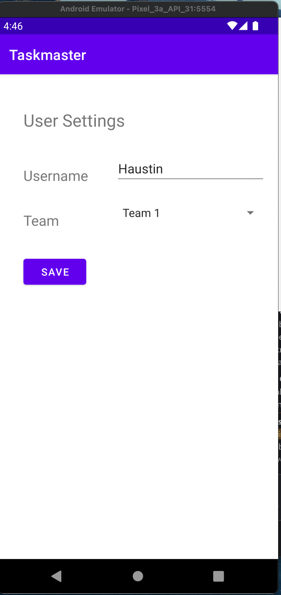

# Taskmaster
**Author**: Haustin Kimbrough
**Version**: 1.0.2

## Overview
<!-- Provide a high level overview of what this application is and why you are building it, beyond the fact that it's an assignment for this class. (i.e. What's your problem domain?) -->

An application to manage tasks.

## Architecture
<!-- Provide a detailed description of the application design. What technologies (languages, libraries, etc) you're using, and any other relevant design information. -->

Application is an android application programmed using the Java language. 

### Homepage

- The main page should have a heading at the top of the page and buttons at the bottom of the page to allow going to the “add tasks” and “all tasks” page.
- Additionally, it contains a RecyclerView that displays a user's tasks (currently hard-coded).
- When a user taps one of the tasks, it should go to the Task Detail page, and the task title, body, state, and addedOn should match the task that was tapped on the previous page.
- Also, an wrench image allows users to visit the Settings page, and once the user has entered their username, it should display “{username}’s tasks” above the three task buttons.
- The application has a Task class. A Task should have a title, a body, and a state. The state should be one of “new”, “assigned”, “in progress”, or “complete”.

### Add Task

- On the “Add a Task” page, allow users to type in details about a new task, specifically a title and a body. When users click the “submit” button, show a “submitted!” label on the page.

### All Tasks

- The all tasks page should just be an image with a back button; it needs no functionality.

### Settings Screenshot

- Settings page. It should allow users to enter their username and hit save.

### Task Detail Screenshot

- Task Detail page should have a title at the top of the page, and a Lorem Ipsum description.

## Credit and Collaborations
<!-- Give credit (and a link) to other people or resources that helped you build this application. -->

